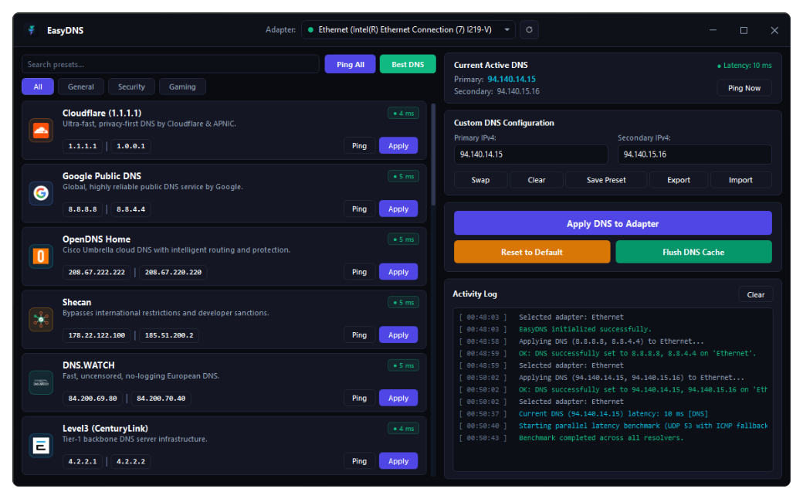

<div align="center">
  
  <h1>EasyDNS</h1>
  <p>A fast, lightweight, and modern Windows desktop utility for configuring network adapter DNS settings.</p>

  <p>
    <a href="https://github.com/Sina-Majd/EasyDNS/releases"></a>
    
    
    
    
    <a href="LICENSE"></a>
  </p>
</div>

<br />

<div align="center">
  
</div>

<br />

## Overview

**EasyDNS** provides an intuitive interface to manage, benchmark, and apply Domain Name System (DNS) configurations across Windows network adapters. Whether you need lower latency for gaming, enhanced privacy and ad blocking, or reliable fallback servers, EasyDNS lets you switch DNS resolvers with a single click.

---

## Features

- **Preconfigured DNS Presets**: Built-in profiles for major public and privacy-focused DNS providers:
  - **General & Privacy**: Cloudflare (1.1.1.1), Google Public DNS, Quad9, OpenDNS Home, Level3.
  - **Security & Ad Blocking**: AdGuard DNS, Control D, CleanBrowsing, Comodo Secure DNS.
  - **Gaming & Regional**: Electro DNS, Radar Game, Shecan, 403 Online.
- **Concurrent Latency Benchmarking**: Measures real-time response times across all resolvers in parallel using lightweight UDP port 53 DNS queries with ICMP fallback.
- **Fastest DNS Auto-Discovery**: One-click benchmark to automatically test and identify the lowest-latency DNS resolver for your active network connection.
- **Dual-Stack DNS (IPv4 & IPv6)**: Validates and configures both IPv4 and IPv6 resolver addresses to prevent IPv6 DNS leaks.
- **Encrypted DNS (DoH)**: Native configuration support for Windows 11 DNS-over-HTTPS.
- **Custom DNS Profiles**: Add, edit, remove, and organize custom DNS presets with full JSON export and import capabilities.
- **DNS Resolver Cache Flushing**: Clear the Windows DNS resolver cache immediately via native Windows API (`dnsapi.dll`).
- **One-Click Default Restoration**: Reset any network adapter back to automatic DHCP DNS assignment instantly.
- **System Tray Integration**: Minimizes unobtrusively to the system notification area with a context menu for quick preset switching.
- **Lightweight Standalone Executable**: Packaged as a compact single-file executable (~1.2 MB) requiring zero installation.

---

## System Requirements

| Requirement | Specification |
| :--- | :--- |
| **Operating System** | Windows 10 (Version 2004 / Build 19041 or higher) or Windows 11 (64-bit) |
| **Runtime** | [.NET 10.0 Desktop Runtime](https://dotnet.microsoft.com/download/dotnet/10.0) |
| **Permissions** | Administrator privileges (required by Windows to modify network adapter settings) |

---

## Getting Started

### Installation
EasyDNS is portable and does not require an installer:

1. Download the latest `EasyDNS.exe` from the [Releases](https://github.com/Sina-Majd/EasyDNS/releases) page.
2. Place the executable in any folder of your choice.
3. Launch `EasyDNS.exe` and confirm the User Account Control (UAC) administrative prompt.

### Basic Workflow
1. **Select Network Adapter**: Use the dropdown at the top to choose the network adapter you want to configure. An operational indicator dot confirms the connection status.
2. **Benchmark Resolvers**: Click **Ping All** to test response times across all presets, or click **Best DNS** to automatically select the fastest responding provider.
3. **Apply Preset**: Click **Apply** on any preset card, or enter custom addresses under **Custom DNS Configuration** and click **Apply DNS to Adapter**.
4. **Restore Defaults**: Click **Reset to Default** at any time to return the adapter to automatic DHCP DNS assignment.

---

## Configuration & Data Storage

Custom DNS presets and user preferences are saved locally as JSON in your user profile:

```
%LocalAppData%\EasyDNS\presets.json
```

> **Note**: If you upgraded from an earlier version, your existing `custom_presets.xml` configuration is automatically detected and migrated on first launch.

---

## Building from Source

### Prerequisites
- [.NET 10.0 SDK](https://dotnet.microsoft.com/download/dotnet/10.0) (or Visual Studio 2026 / JetBrains Rider with .NET desktop development workload).
- Windows 10 or 11 (x64).

### Build Commands

```bash
# Clone the repository
git clone https://github.com/Sina-Majd/EasyDNS.git
cd EasyDNS

# Compile the solution in Release mode
dotnet build EasyDNS.csproj -c Release

# Execute the automated unit test suite
dotnet test EasyDNS.Tests/EasyDNS.Tests.csproj -c Release

# Publish a single-file standalone executable
dotnet publish EasyDNS.csproj -c Release -f net10.0-windows -r win-x64 -p:PublishSingleFile=true -p:DebugType=None -p:DebugSymbols=false --self-contained false -o bin/Publish
```

Alternatively, you can run the included automation scripts:
- `build.bat`: Compiles the project and runs the test suite.
- `publish.bat`: Builds and publishes the optimized standalone executable to `bin\Publish\EasyDNS.exe`.

---

## Architecture & Technology Stack

EasyDNS is organized using Clean Architecture principles and the Model-View-ViewModel (MVVM) pattern:

- **Presentation Layer**: Windows Presentation Foundation (WPF) with DirectX hardware acceleration and custom dark styling.
- **ViewModel Layer**: Reactive state management built on `CommunityToolkit.Mvvm`.
- **Core Domain**: Protocol-agnostic models, contracts, and IP address validation (`IpValidator`).
- **Infrastructure Layer**:
  - Native Windows IP Helper API (`iphlpapi.dll`) and PowerShell CIM for network adapter configuration.
  - Asynchronous UDP socket testing with ICMP ping fallback for latency measurements.
  - Compile-time source-generated JSON serialization via `System.Text.Json`.
- **Automated Testing**: Comprehensive unit test suite covering validation logic, preset serialization, and latency benchmarking.

---

## License

This project is licensed under the [MIT License](LICENSE).
